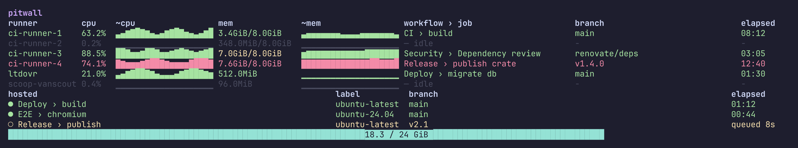

# pitwall

btop-like terminal UI for self-hosted GitHub Actions runners: live CPU/mem per runner, joined with the workflow › job currently running. Covers both the docker runners and the box's **native (non-docker) `Runner.Listener` runners**.



> Screenshot with dummy data (Mocha theme). Regenerate it with `make screenshot`.

## What you see

A table, one row per runner (docker runners first, then native):

| runner | cpu | ~cpu | mem | ~mem | workflow › job | elapsed |
|---|---|---|---|---|---|---|

- **runner** — docker container name (e.g. `ci-runner-1`) or, for native runners, the systemd unit's registration segment (e.g. `ltdovr`, `scoop-vanscout`).
- **cpu / mem** — live usage. Docker: from the rootless docker socket. Native: from the systemd unit's cgroup v2 stats. Memory is the working set (`inactive_file` subtracted) on both, shown as `used/limit`, or just `used` for uncapped native runners.
- **~cpu / ~mem** — block-char sparklines of the last ~40s (20 samples at the 2s
  poll). CPU auto-scales to its window max with a 10% floor, so idle jitter reads
  as a flat baseline; mem scales to the limit (flat for uncapped native runners).
  History is in-memory and resets on restart.
- **workflow › job** — `— idle` when no in-progress job is joined, `busy` when a runner is busy but no per-job detail is available (org-scoped runners; see below), else `Workflow Name › Job Name`.
- **elapsed** — ticking duration since the job started; `-` when idle.

Rows are colored by load using the Catppuccin palette over a full Catppuccin background: muted gray = idle, green = busy, red = near-cap (mem ≥ crit % of a finite limit — the whole row goes red). As an early warning *below* near-cap, the `mem` cell alone turns the warn color (yellow) while its memory is in the warn band (≥ warn %, < crit %), so a busy runner stays green with just a yellow mem cell. Native runners are uncapped, so they never enter the warn/near-cap tiers. The gauge at the bottom shows summed **docker** runner memory against a configurable slice cap, using the same thresholds: teal normally, yellow (` ⚠ warn`) in the warn band, red (` ⚠ NEAR CAP`) at the cap; native runners live in a different slice and don't count toward it. Pick a flavor with `PITWALL_THEME` (see [Configuration](#configuration)). Colors assume a truecolor terminal; on 16/256-color terminals they downsample to the nearest available color.

## Native runners

Native runners are discovered automatically at startup by enumerating `actions.runner.*.service` systemd units and reading each unit's `.runner` config (for its GitHub scope) and cgroup (for stats). Notes:

- **Discovery is one-shot** — adding or removing a runner needs a pitwall restart.
- **Repo-scoped** native runners get full `workflow › job` detail, matched by GitHub runner name (`.runner` `agentName`) within their repo.
- **Org-scoped** runners (e.g. `ltdovr`) can only ever show **busy/idle with no `workflow › job` detail** — GitHub exposes no cheap per-runner job endpoint at org scope. This is by design, not a bug, and holds even after granting `admin:org`.
- Org busy status uses `orgs/{org}/actions/runners`, which needs the `admin:org` gh scope. Without it the call 403s and the org runner simply shows idle — no error banner. Grant it with `gh auth refresh -h github.com -s admin:org` if you want org busy status.
- If pitwall runs as a different user than owns a runner install and can't read its `.runner`, that runner still appears with live CPU/mem but always renders idle (no job matching).
- A native runner whose unit stops (its cgroup disappears) simply drops off the table that cycle, like an ephemeral docker container deregistering — not an error. A genuine cgroup read failure (e.g. a permission change) drops only that runner's row and names it in the status banner; the other native runners keep showing fresh readings.
- Off-box or in CI (no systemd / no matching units), native discovery yields nothing and pitwall runs docker-only.

## Hosted jobs

Below the runner table, pitwall lists **GitHub-hosted** jobs for the configured
repos — both running and queued. Hosted runners are ephemeral per-job VMs on
GitHub's infrastructure, so there is **no CPU/mem to show**: this section carries
only `workflow › job`, the requested runner label (`ubuntu-latest`, …), branch,
and elapsed (running) or wait time (`queued 8s`, from the job's creation).

- `●` a running hosted job; `○` a queued one (waiting for a hosted runner).
- Sourced from **repo** scopes only — the per-job endpoint is repo-scoped, so
  org-scoped entries contribute nothing here (same limitation as org busy status).
- A job is treated as self-hosted (and shown in the table above instead) when its
  `labels` include `self-hosted`; everything else is hosted.
- The section is hidden when there are no hosted jobs, and caps at a handful of
  rows with a `+N more` line so a large matrix can't crowd out the runner table.

## Vercel deployments

Below the hosted section, pitwall lists **in-flight Vercel builds** for the
configured repos — both building and queued — hidden entirely when nothing is
building. Columns: `project`, `target`, `branch`, the commit summary, and
elapsed (building) or wait time (`queued 8s`, from the deployment's creation).

- `●` a building deployment; `○` a queued one (waiting for a build slot).
- Data source: shells out to the `vercel` CLI (`vercel list --format json
  --status BUILDING,QUEUED`) — it reuses your `vercel login` session, so no
  token is needed. Auto-detected: if `vercel` isn't installed or you're not
  logged in, the section is simply absent, no error banner.
- A deployment is shown when its `meta.githubOrg`/`meta.githubRepo` matches
  one of your configured `repo`s.
- **`vercel list` only sees the CLI's active Vercel scope/team.** pitwall is
  multi-repo, and repos under different owners commonly map to different
  Vercel teams — so a configured repo whose Vercel project lives under
  another team shows **nothing** here. This is by design, not a bug: an empty
  Vercel section for that repo is the expected result of a single-scope CLI.

## Requirements

- Linux with cgroup v2 (native runners read `/sys/fs/cgroup`) and `systemctl` (for native runner discovery — optional; absent = docker-only)
- A reachable rootless Docker socket (default `/run/user/$UID/docker.sock`)
- An authenticated `gh` CLI (used for job data)

## Install

### Prebuilt binary

Download a static Linux binary from the [latest release](https://github.com/erwins-enkel/pitwall/releases/latest). Two targets are published, each with a matching `.sha256` checksum:

- `pitwall-x86_64-unknown-linux-musl.tar.gz`
- `pitwall-aarch64-unknown-linux-musl.tar.gz`

```sh
curl -sSLO https://github.com/erwins-enkel/pitwall/releases/latest/download/pitwall-x86_64-unknown-linux-musl.tar.gz
tar xzf pitwall-x86_64-unknown-linux-musl.tar.gz
install -Dm755 pitwall ~/.local/bin/pitwall
```

The binaries are statically linked (musl), so they run on any Linux distribution. Make sure `~/.local/bin` is on your `PATH`.

### Build from source

```sh
make install
```

Builds a release binary and installs it to `~/.local/bin/pitwall`.

Manual alternative:

```sh
cargo build --release
mkdir -p ~/.local/bin
cp target/release/pitwall ~/.local/bin/pitwall
```

## Usage

```sh
pitwall
```

Quit with `q`, `Esc`, or `Ctrl-C` — the terminal is restored on exit.

## Configuration

Every setting is optional and resolved in this order (first wins): **env var →
config file → built-in default**.

| Setting | Env var | File key | Default |
|---|---|---|---|
| socket | `PITWALL_SOCKET` | `socket` | `$DOCKER_HOST` (with `unix://` stripped) if set, else `/run/user/$UID/docker.sock` |
| repo | `PITWALL_REPO` | `repo` | `owner/repo` (set this to your runners' repo; comma-separated string or array in TOML; all listed repos are polled for job detail and hosted jobs) |
| prefix | `PITWALL_PREFIX` | `prefix` | `ci-runner-` (must match your runner container names, e.g. `myorg-ci-runner-`) |
| slice cap (GiB) | `PITWALL_SLICE_CAP_GIB` | `slice_cap_gib` | `24` |
| theme | `PITWALL_THEME` | `theme` | `mocha` — Catppuccin flavor: `mocha`, `macchiato`, `frappe`, or `latte` (light). Unknown values fall back to `mocha`. |
| mem warn % | `PITWALL_MEM_WARN_PCT` | — | `85` (warn tier: yellow mem cell / gauge) |
| mem crit % | `PITWALL_MEM_CRIT_PCT` | — | `90` (critical tier: red row / gauge) |

An empty env var (e.g. `PITWALL_REPO=`) is treated as unset, falling through to
the file value, then the default.

Both memory percents are clamped to `0..=100`; if warn exceeds crit it is pinned
down to crit so the tiers can't invert.

### Config file

An optional TOML file provides persistent settings. It is read from
`$XDG_CONFIG_HOME/pitwall/config.toml` (falling back to
`~/.config/pitwall/config.toml`); set `PITWALL_CONFIG=/path/to/config.toml` to
point elsewhere. All keys are optional:

```toml
# ~/.config/pitwall/config.toml
repo          = ["your-org/your-repo", "your-org/another-repo"]  # one or more repos
socket        = "/run/user/1000/docker.sock"   # 1000 = your numeric UID (`id -u`)
prefix        = "ci-runner-"
slice_cap_gib = 24
theme         = "mocha"
```

A ready-to-copy, fully-commented version lives at
[`config.example.toml`](config.example.toml) in the repo root —
`cp config.example.toml ~/.config/pitwall/config.toml` and uncomment what you
need.

Notes:

- **`socket` beats `DOCKER_HOST`.** The full socket order is `PITWALL_SOCKET` →
  file `socket` → `DOCKER_HOST` → `/run/user/$UID/docker.sock`. The file value
  intentionally overrides the ambient `DOCKER_HOST` env var, since it is
  deliberate pitwall configuration rather than an ambient docker setting.
- **Docker runners tagged with first repo.** When configuring multiple repos,
  Docker/prefix-matched runners are tagged with the **first configured repo**.
  List the repo your Docker runners belong to first, or they won't match their
  jobs and will show idle. Native runners are unaffected — they carry their own
  repo scope from discovery.
- A malformed file, or one with an unknown key, is a hard error: pitwall reports
  it and exits without starting the UI.
- The default file is optional — its absence is fine. A `PITWALL_CONFIG` path
  that is set but missing is an error.

## How it works

- **Resources** — polled every ~2s via `bollard` against the rootless docker socket. Docker's stats API is one-shot (no streaming), so pitwall retains the previous poll's CPU counters per container id and computes CPU% as a delta between samples.
- **Jobs** — polled every ~15s via `gh`. Only in-progress jobs on self-hosted runners are considered; GitHub-hosted, queued, and completed jobs are excluded.
- **Join** — by trailing runner index: container `ci-runner-N` matches GitHub runner name `runner-N`.
- **Gotcha** — a running container with no in-progress job is normal idle state, not an error. The runners are ephemeral and deregister between jobs, so gaps between "container up" and "job assigned" are expected.
- **Degradation** — a broken docker socket or `gh` failure surfaces as a red status banner and keeps the last-known-good data on screen instead of blanking the UI; the empty state is self-diagnosing (`waiting for runners…`, `waiting for runner stats…`, or `N containers running, none match prefix '…'`). No source failure panics; `q`/`Esc`/`Ctrl-C` always restore the terminal.
